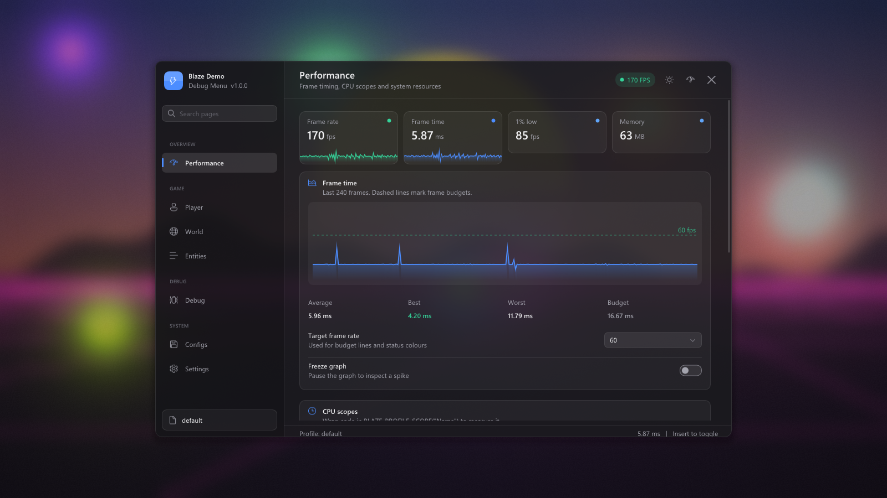
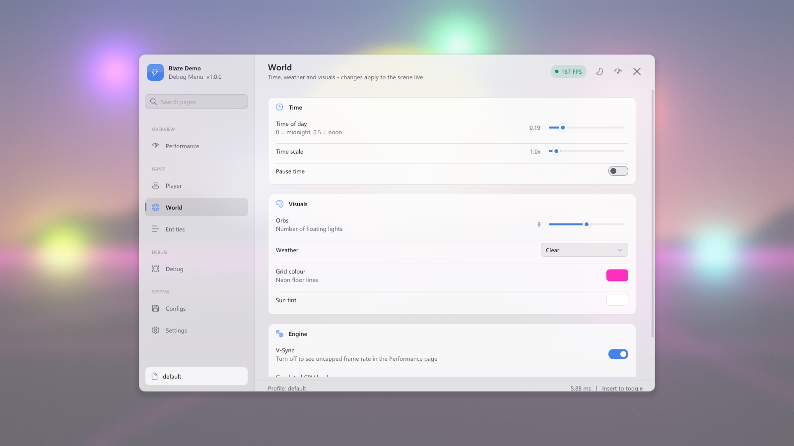
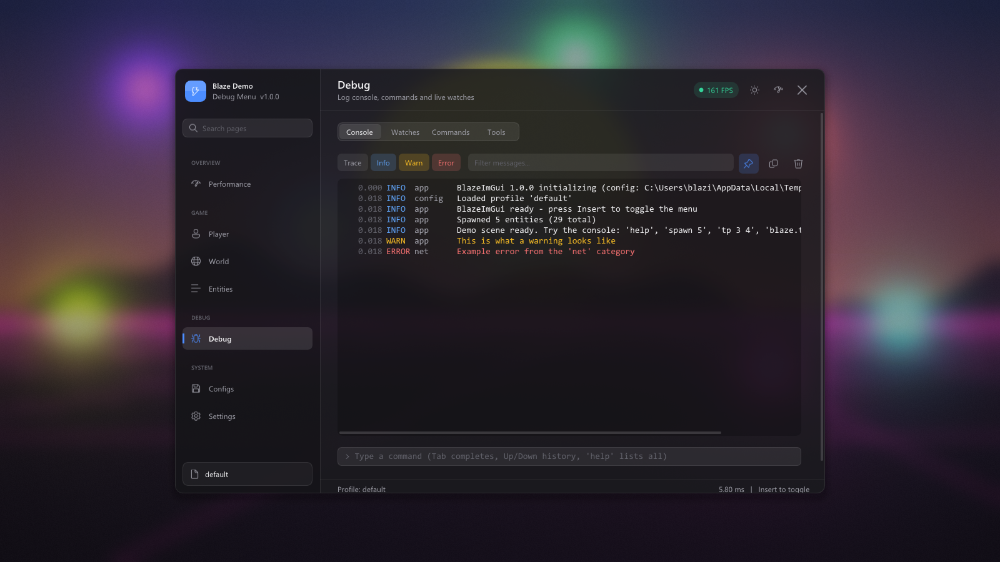

# BlazeImGui

[](https://github.com/Zckyy/BlazeImGui/actions/workflows/build.yml)

A modern, drop-in **Dear ImGui debug menu** for Windows / Direct3D 11 games and tools.
Games on **Direct3D 12** (or any renderer with its own Dear ImGui backend) can use it too,
without the acrylic blur. See [Other renderers](#other-renderers-d3d12).



| Light theme | Debug console |
|---|---|
|  |  |

## Features

- **Acrylic background blur.** A Windows 11 style blur of the game frame (dual-Kawase, with saturation, tint, luminosity, and grain). It fades in and out with the menu and costs about 0.1 ms at 1080p. Pipeline state is fully restored afterwards, so it's safe inside a hooked `Present`.
- **Light, dark, and System themes** with eight accent presets or any custom colour. Theme and accent changes cross-fade.
- **Modern layout.** Sidebar navigation with search, page headers, cards, Win11 Settings-style rows (toggles, sliders, combos, colour pickers, keybinds), toasts, and a live FPS chip.
- **Performance page.** FPS, frame time graph with budget lines, 1% lows, CPU scopes (`BLAZE_PROFILE_SCOPE`), custom counters, process CPU and RAM, and VRAM usage.
- **Debug page.** Log console with level filters, search, copy, and a command line with tab completion and history. Also live watches, a command browser, and the ImGui demo, metrics, and style tools.
- **Config profiles.** Bind any variable with one call and it saves and loads with named JSON profiles. Includes autosave, dirty tracking, duplicate/rename/delete, and clipboard import/export.
- **Performance overlay.** A small HUD that stays up while the menu is closed.
- **AI friendly.** See [AGENTS.md](AGENTS.md). It has a stable public API with documented headers, human- and AI-editable JSON configs, console commands to set any variable and dump state as JSON, and a headless `--capture` mode so agents can screenshot UI changes.
- **No assets to ship.** Fonts and icons come from Windows (Segoe UI, Segoe Fluent Icons). ImGui is pinned via FetchContent.

## Quick start

```bash
cmake --preset vs2026          # or vs2022; generates build/BlazeImGui.slnx
cmake --build --preset release
build/Release/blaze_demo.exe
```
Press **Insert** to toggle the menu. The key can be rebound in Settings > Input.

## Using it in your project

```cmake
add_subdirectory(BlazeImGui)            # or FetchContent
target_link_libraries(my_game PRIVATE Blaze::ImGui)
```

```cpp
#include <blaze/blaze.h>

// Startup
blaze::InitInfo info;
info.device = device; info.context = context; info.swapChain = swapChain;
info.hwnd = hwnd; info.appName = "My Game";
blaze::Initialize(info);

// WndProc
if (blaze::WndProcHandler(hwnd, msg, wParam, lParam)) return 1;

// Every frame, after your scene is rendered
blaze::NewFrame();
blaze::Render(backBufferRTV);
swapChain->Present(1, 0);

// Resize:  blaze::OnResizeBegin(); swapChain->ResizeBuffers(...); blaze::OnResizeEnd();
// Exit:    blaze::Shutdown();   // saves configs
```

Add your own page:

```cpp
static bool  g_godMode = false;
static float g_speed = 6.0f;
blaze::config::Bind("player.god_mode", &g_godMode);   // saved per profile
blaze::config::Bind("player.speed", &g_speed);

blaze::Panel p;
p.id = "game.player"; p.title = "Player"; p.category = "Game"; p.icon = blaze::icons::Person;
p.draw = [] {
    using namespace blaze::ui;
    if (BeginCard("Cheats", blaze::icons::Flash)) {
        Toggle("God mode", &g_godMode, "Player takes no damage");
        SliderFloat("Move speed", &g_speed, 0, 20, "%.1f m/s");
    }
    EndCard();
};
blaze::RegisterPanel(p);
```

Profiling, logging, commands and watches:

```cpp
void Physics::Step() { BLAZE_PROFILE_SCOPE("Physics"); /* ... */ }
blaze::perf::SetCounter("Entities", world.size());
blaze::Log::Warn("Missing texture %s", path);
blaze::debug::RegisterCommand("spawn", "spawn <n>", [](const blaze::debug::Args& a) { /* ... */ });
blaze::debug::Watch("Player pos", [] { return blaze::debug::Fmt("%.1f, %.1f", x, y); });
```

**Step-by-step implementation guide (for AI agents and developers): [docs/INTEGRATION.md](docs/INTEGRATION.md).** It covers all three integration modes, including a hooked `Present`, along with rules, a verification checklist and troubleshooting.

[templates/panel_template.cpp](templates/panel_template.cpp) is a complete starting point. Integration modes for hooked `Present` and for apps that already use ImGui are documented at the top of [include/blaze/blaze.h](include/blaze/blaze.h).

## Other renderers (D3D12)

The menu, pages, config, console and profiling are renderer-agnostic. Only the acrylic blur
needs D3D11. For a host that already runs Dear ImGui on another backend:

```cmake
set(BLAZE_FETCH_IMGUI OFF CACHE BOOL "" FORCE)     # use the host's 'imgui' target
set(BLAZE_RENDERER_DX11 OFF CACHE BOOL "" FORCE)   # no D3D11 / d3dcompiler dependency
add_subdirectory(BlazeImGui)
```

Then call `blaze::Initialize` with `manageImGui = false` and no device, and call
`blaze::DrawUI()` inside your ImGui frame. When blur isn't available the menu uses an opaque
background. [docs/INTEGRATION.md](docs/INTEGRATION.md) has the full walkthrough and the
lessons from a real hooked-`Present` D3D12 integration (input routing, toggle key, fonts,
static CRT, shutdown order).

## Configuration files

Stored in `%APPDATA%\<appName>\` by default:

```
blaze_settings.json     menu settings (theme, blur, hotkey, overlay)
profiles/default.json   { "blaze_config_version": 1, "profile": "default", "values": { "player.god_mode": false, ... } }
```

## Demo command line

| Flag | Purpose |
|---|---|
| `--capture out.png` | Render a hidden window, save a screenshot, and exit |
| `--page <id>` | Open a page (`blaze.performance`, `blaze.debug`, `blaze.configs`, `blaze.settings`, `game.world`, ...) |
| `--exec "<cmd>"` | Run a console command at startup (repeatable), e.g. `"blaze.theme light"` |
| `--delay <s>`, `--size WxH`, `--config-dir <dir>` | Capture timing, window size, config folder |
| `--drag x,y,dx,dy` | Inject a left-button drag (client pixels) to test dragging, sliders, etc. headlessly |
| `--dump state.json` | With `--capture`: also write `DumpStateJson()`, which includes the main window rect |

## Requirements

Windows 10/11, MSVC (VS 2022 or 2026), and CMake 3.20+. The demo and the blur need a Direct3D 11
(feature level 10.1+) GPU.

See [CHANGELOG.md](CHANGELOG.md) for what changed between versions.
